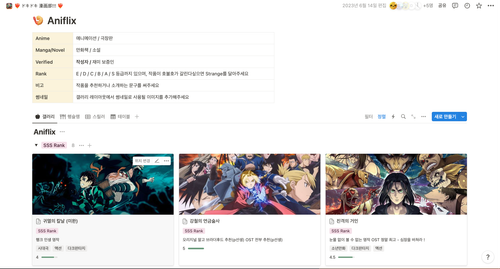
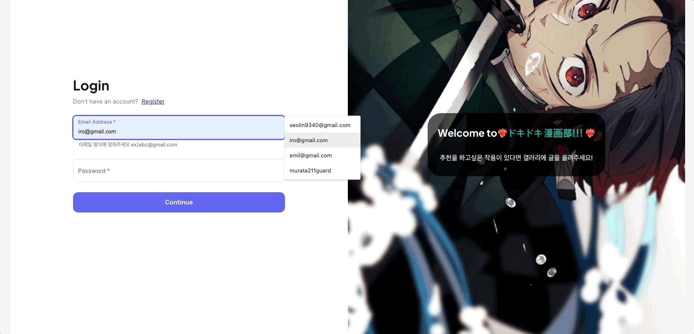
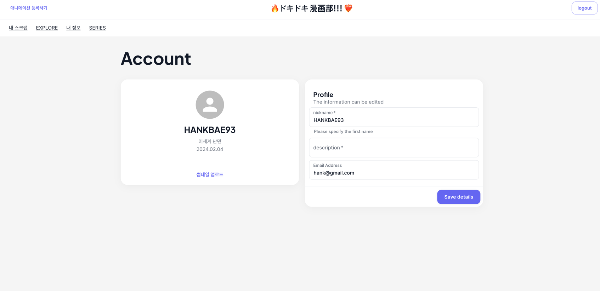

# ❤️‍🔥ドキドキ 漫画部!!! ❤️‍🔥 client-server

## introduction

직접 노션으로 제작하여 사내에 공유했던 애니메이션 커뮤니티를 웹 서비스로 구현하여 기존에 활용했던 등급제, 평점제, 커뮤니티 기능 등을 재현하였습니다.

## Tech

> **Next.js, Typescript, material-ui, react-query, recoil**
>
> Deploy : Docker, Google Cloud Platform(VM instance)

## 페이지 구성

- 로그인/회원가입 페이지
- 개인정보설정 페이지
- 스크랩 페이지
- 애니메이션 탐색 페이지
  - 애니메이션 시리즈별 조회 페이지
  - 애니메이션 상세 페이지
  - 애니메이션 등록 페이지
  - 애니메이션 수정 페이지

## 로그인/회원가입 페이지

> 사용자가 로그인 또는 회원가입하는 페이지입니다. 

## 개인정보설정 페이지

> 사용자 정보를 확인할 수 있는 페이지입니다. 현재 등급과 개인정보 등을 수정할 수 있습니다.

## 스크랩 페이지

> 사용자가 스크랩한 애니메이션 목록을 조회할 수 있습니다.

## 애니메이션 탐색 페이지

> 사용자가 애니메이션을 탐색하는 페이지입니다. AND/OR, 태그, 제목 검색 등 다양한 필터링 검색과 페이지네이션을 지원합니다. 

## 애니메이션 시리즈 페이지

> 같은 IP별로 묶인 애니메이션 리스트를 조회하는 페이지입니다. 애니메이션을 등록할 때 시리즈 IP를 추가할 수 있습니다.

## 애니메이션 상세 페이지

> 애니메이션 상세 페이지입니다. 스크랩, 리뷰 작성, 여러 장의 슬라이드 등 다양하게 구현해놓았습니다.

## 애니메이션 등록 페이지

> 애니메이션 등록 페이지입니다. 애니메이션의 자세한 정보를 등록하고 시리즈 IP를 링크할 수 있습니다.

## 애니메이션 수정 페이지

> 등록한 애니메이션을 수정할 수 있는 페이지입니다. 글의 작성자인 경우 연필 아이콘을 클릭하여 들어갈 수 있습니다.
